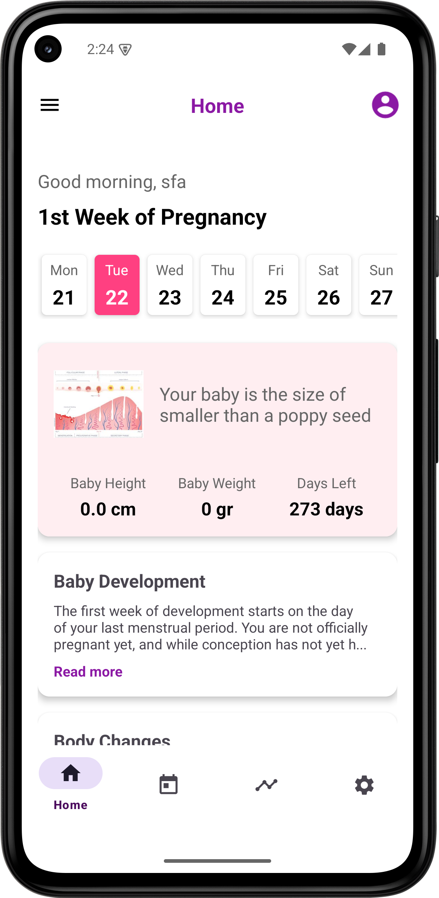
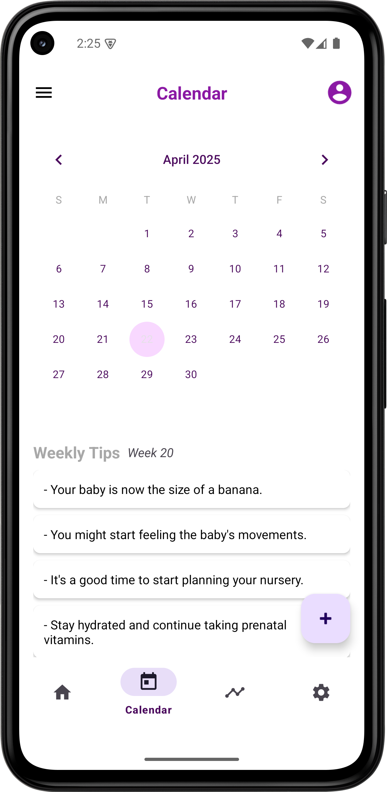
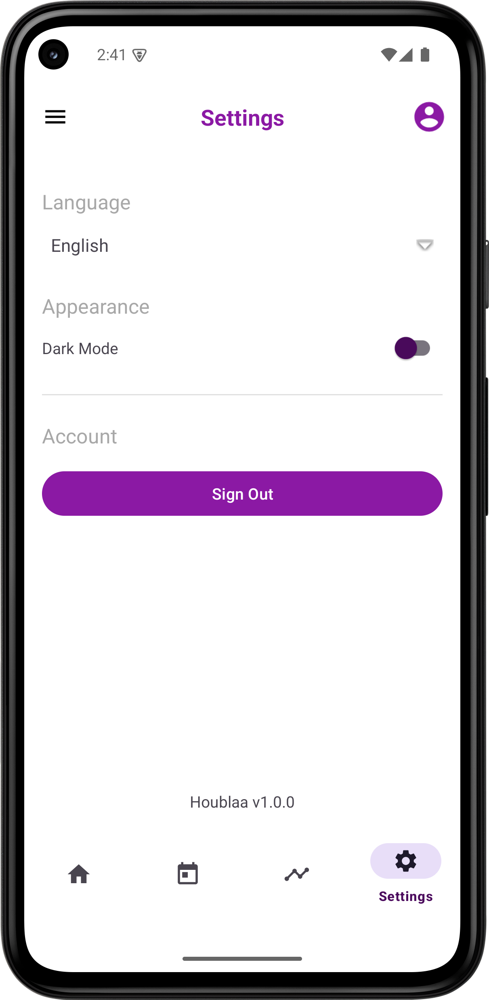

# HouBlaa - Pregnancy Tracking Application

## Overview

HouBlaa is a comprehensive pregnancy tracking mobile application designed to accompany women throughout their pregnancy journey. The app provides personalized week-by-week tracking, information on baby development, body changes, and helpful tips for each stage of pregnancy.

## Features

- **User Authentication**: Secure login and registration using Firebase Authentication
- **Personalized Dashboard**: Home screen showing current pregnancy week, baby development, and body changes
- **Interactive Timeline**: Vertical timeline displaying all 42 weeks of pregnancy with the current week highlighted
- **Event Calendar**: Track appointments, check-ups, and important pregnancy milestones
- **Weekly Content**: Detailed information about baby's development and bodily changes for each week
- **User Profile**: Manage personal information, due date, and pregnancy details
- **Read More Functionality**: Expandable content sections for additional information

## Screenshots

<p align="center">
  
  
  
  
</p>

## Technologies Used

- **Language**: Kotlin
- **Architecture**: MVVM (Model-View-ViewModel)
- **Database**: Firebase Firestore
- **Authentication**: Firebase Authentication
- **UI Components**: Material Design components
- **Asynchronous Operations**: Kotlin Coroutines
- **Data Binding**: View Binding

## Setup & Installation

1. Clone the repository:
   ```
   git clone https://github.com/yourusername/houblaa.git
   ```

2. Open the project in Android Studio

3. Connect the app to Firebase:
   - Create a new Firebase project at [Firebase Console](https://console.firebase.google.com/)
   - Add an Android app to the Firebase project with package name `com.jdcoding.houbllaa`
   - Download the `google-services.json` file and place it in the app directory
   - Enable Authentication and Firestore in the Firebase Console

4. Build and run the application

## Project Structure

The application follows a modular architecture:

- **`adapters/`**: RecyclerView adapters for lists and grids
- **`data/`**: Data classes and static data providers 
- **`di/`**: Dependency injection components
- **`models/`**: Data models
- **`network/`**: API clients and network operations
- **`ui/`**: Activities, fragments, and ViewModels organized by feature
- **`utils/`**: Utility classes and helper functions

## Database Structure

The Firestore database has the following collections:

- **`users`**: User profiles and pregnancy information
- **`events`**: Calendar appointments and events
- **`tips`**: Weekly pregnancy tips and advice

## Future Enhancements

- Notifications for appointments and weekly updates
- Baby name suggestions
- Contraction timer
- Weight and symptom tracking
- Community features for connecting with other expectant mothers
- Integration with healthcare providers

## Contributing

1. Fork the repository
2. Create your feature branch (`git checkout -b feature/amazing-feature`)
3. Commit your changes (`git commit -m 'Add some amazing feature'`)
4. Push to the branch (`git push origin feature/amazing-feature`)
5. Open a Pull Request

## License

This project is licensed under the MIT License - see the LICENSE file for details.

## Acknowledgements

- [Firebase](https://firebase.google.com/) for backend services
- [Material Design Components](https://material.io/components) for UI elements
- All contributors who participated in this project
